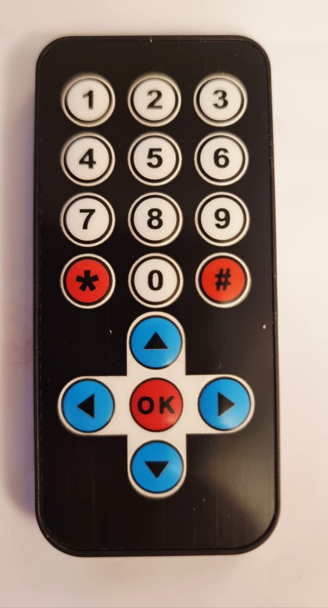

## DecodeHX1838
Decodes IR Remote Control HX1838 codes for each button:

## Gebruiken als extensie

Deze repository kan worden toegevoegd als **extensie** in MakeCode.

* open [https://makecode.microbit.org/](https://makecode.microbit.org/)
* klik op **Nieuw project**
* klik op **Extensies** onder het tandwielmenu
* zoeken naar **https://github.com/roboracemsw/decodehx1838** en importeren

## Dit project bewerken

Om deze repository te bewerken in MakeCode.

* open [https://makecode.microbit.org/](https://makecode.microbit.org/)
* klik op **Importeren** en klik vervolgens op **Importeer URL**
* plak **https://github.com/roboracemsw/decodehx1838** en klik op importeren

#### Metadata (gebruikt voor zoeken, rendering)

* for PXT/microbit

